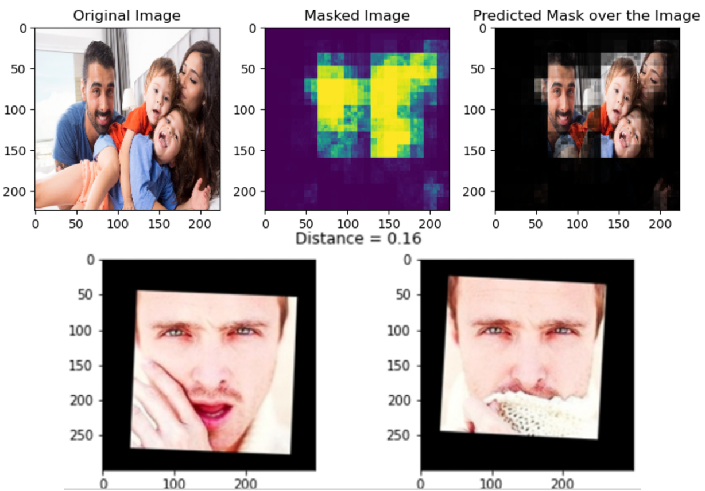

# Face Recognition

## Implement face recognition model

 The Face Aligned Face Dataset from Pinterest contains <b>10,770</b> images for <b>100 people</b>. So the objective is to implement a face recognition model for a company, which intends to recognize celebrity faces from images. Generated an embeddings vector on each face in the dataset and built a classifier in order to map each image to its right person.
. 

## ML libraries/Architectures
TensorFlow, Scikit-learn, Convolutional Neural network
